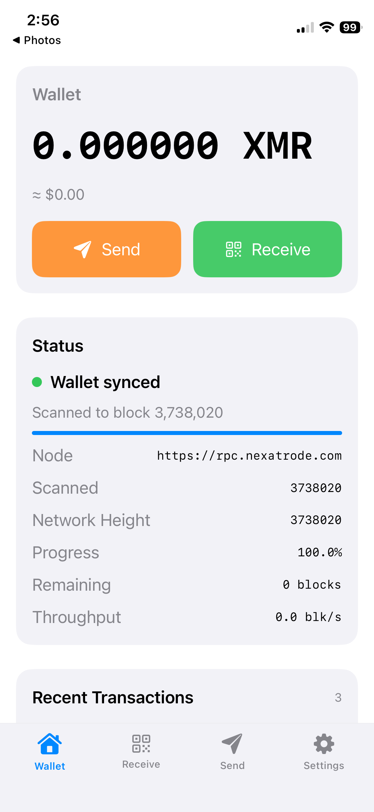
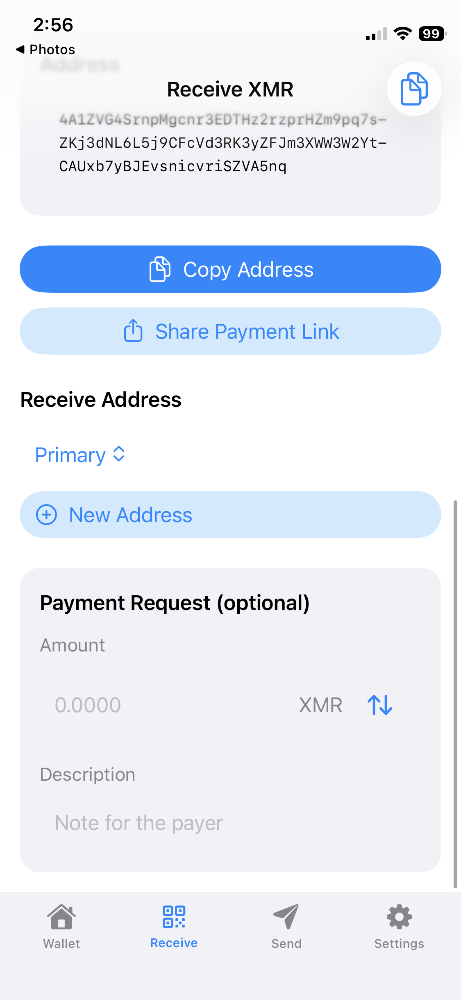
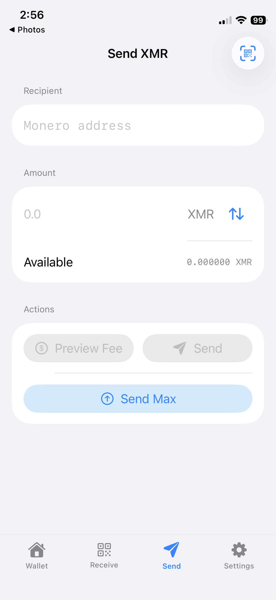
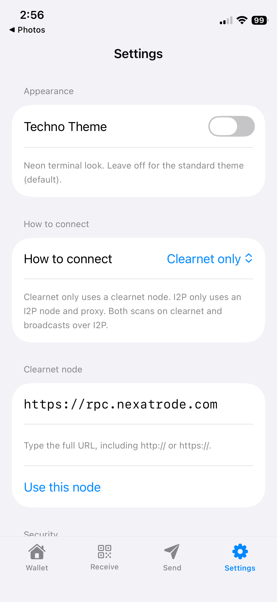
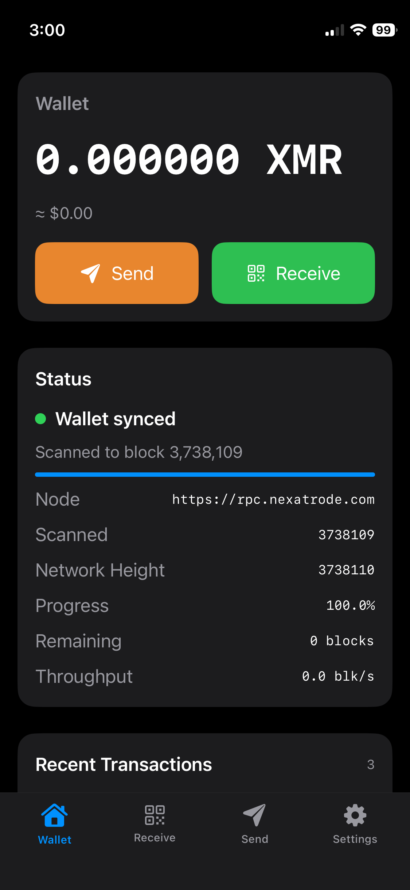
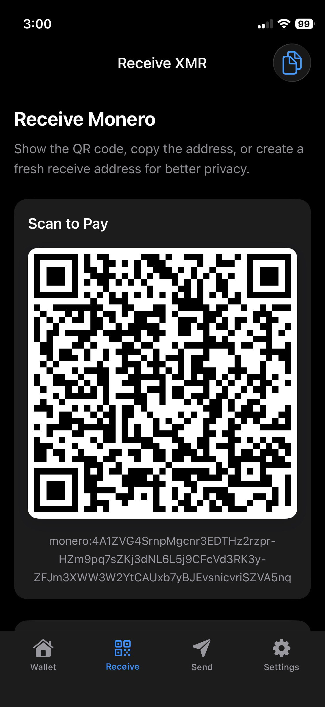
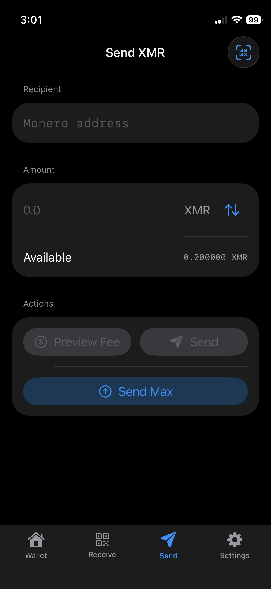
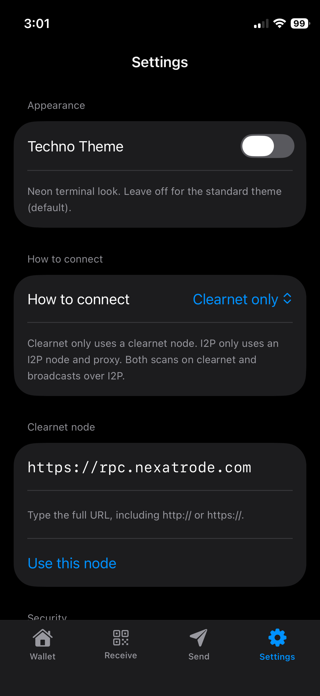

# nexawal

`nexawal` is an iOS Monero wallet built on top of `monero-oxide` and the `MoneroWalletCoreFFI` layer.

- iOS app: this repository
- Android app: [nexawal-android](https://github.com/Nexatrode/nexawal-android)
- Shared wallet core (SPM): [MoneroWalletCoreFFI](https://github.com/cacaosteve/MoneroWalletCoreFFI) (`main`)
- Monero library work: [monero-oxide](https://github.com/cacaosteve/monero-oxide) (fork pin used by the core)
- Website: [nexatrode.com](https://nexatrode.com)

## Setup

```bash
git clone https://github.com/Nexatrode/nexawal.git
cd nexawal
open nexawal.xcodeproj
```

Xcode resolves `MoneroWalletCoreFFI` from GitHub on branch `main` (prebuilt xcframework — no Rust required). Use **File → Packages → Update to Latest Package Versions** to move to the tip of that branch.

## Screenshots

### Light

| Wallet | Receive |
| --- | --- |
|  |  |

| Send | Settings |
| --- | --- |
|  |  |

### Dark

| Wallet | Receive |
| --- | --- |
|  |  |

| Send | Settings |
| --- | --- |
|  |  |

## Features

- Single-wallet Monero app (create or import)
- Create-flow seed backup gate (write-down confirmation + word check) before the wallet is persisted
- Optional Face ID / Touch ID for unlock and send
- Techno Theme toggle (on = neon terminal look; off/default = standard look)
- Clearnet / I2P / hybrid node routing
- Sync status with honest tip/scanned progress; node errors surface when refresh fails
- Receive: QR, copy address, copy payment URI when an amount is set, subaddresses
- Send / send-max with fee preview; prepare → durable persist → relay under the hood
- Transaction details with copy txid and optional explorer link

## Notes

- Uses a native wallet core built from `monero-oxide` via `MoneroWalletCoreFFI`
- Syncs against standard Monero nodes (local or remote), including the configured I2P RPC path when enabled
- Default daemon is `https://rpc.nexatrode.com` (type a full `http://` or `https://` URL to override)
- Feature parity target: [nexawal-android](https://github.com/Nexatrode/nexawal-android)
- Unaudited software. You are responsible for backups and funds. A remote node can see your IP and sync queries.

## Privacy

See [docs/PRIVACY.md](docs/PRIVACY.md) (bundled offline in the app under Settings → Privacy policy). App Store listings can still use the HTTPS URL on nexatrode.com if required by the store form.

## Terms

See [docs/TERMS.md](docs/TERMS.md) (bundled offline in the app).

## License

[MIT](LICENSE). Downstream code such as `monero-oxide` remains under its own MIT terms; keep those notices when you redistribute.
